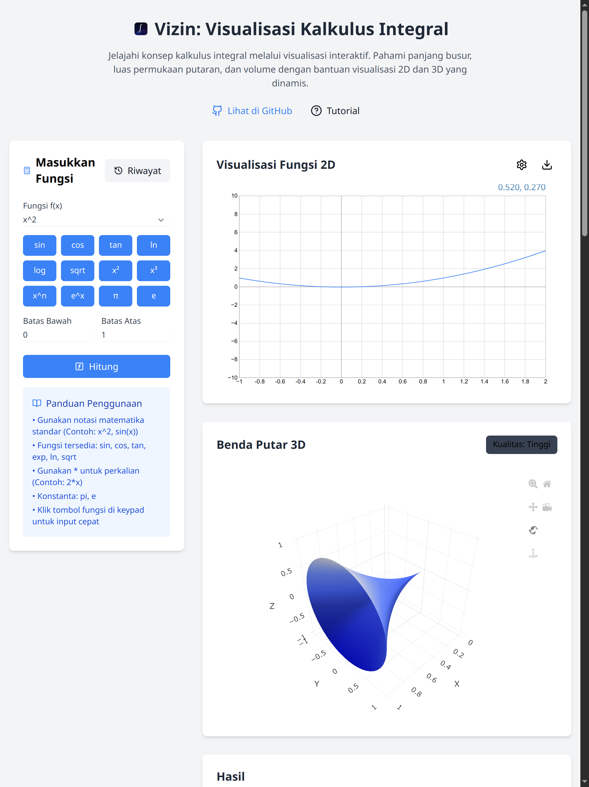

# 📐 Vizin: Interactive Calculus Visualization | Visualisasi Kalkulus Interaktif

[English](#english) | [Indonesian](#indonesian)


<div id="english">

## 📖 Overview
Vizin is an interactive web application designed to help students and educators understand integral calculus through dynamic visualizations. It provides real-time 2D and 3D visualizations of mathematical functions, making complex calculus concepts more accessible and engaging.

## ✨ Key Features
- 🎯 **Scientific Calculator Interface** - Input mathematical functions with an intuitive keypad
- 📈 **2D Function Plotting** - Visualize functions with interactive graphs
- 🔄 **3D Rotation Visualization** - See solids of revolution in 3D with rotation controls
- 📏 **Comprehensive Calculations**
  - Arc length computation
  - Surface area of revolution
  - Volume of revolution
- 📝 **Step-by-Step Solutions** - Detailed explanation of calculation steps
- 💾 **Calculation History** - Save and review previous calculations
- 🎓 **Interactive Learning Mode** - Guided tutorials and explanations
- 🌙 **Dark/Light Theme** - Comfortable viewing in any environment
- 📱 **Responsive Design** - Works seamlessly on desktop and mobile devices

## 🛠️ Technologies Used
- React 18
- TypeScript
- Tailwind CSS
- Math.js
- Plotly.js
- Function-plot
- KaTeX
- Zustand
- Headless UI

## 📋 Prerequisites
```bash
Node.js 18.0 or higher
npm 9.0 or higher
```

## ⚙️ Installation & Setup
```bash
# Clone the repository
git clone https://github.com/Gar07/vizin.git

# Navigate to project directory
cd vizin

# Install dependencies
npm install

# Start development server
npm run dev
```

## 🎯 Usage


1. Enter a mathematical function using the scientific keypad
2. Set the lower and upper bounds for integration
3. Click "Calculate" to see results and visualizations
4. Explore 2D and 3D visualizations with interactive controls
5. Review step-by-step calculation explanations

## 📊 Project Structure
```
vizin/
├── src/
│   ├── components/        # React components
│   ├── hooks/            # Custom React hooks
│   ├── store/            # Zustand state management
│   ├── utils/            # Utility functions
│   └── types/            # TypeScript definitions
├── public/               # Static assets
└── README.md
```

</div>

<div id="indonesian">

## 📖 Gambaran Umum
Vizin adalah aplikasi web interaktif yang dirancang untuk membantu siswa dan pendidik memahami kalkulus integral melalui visualisasi dinamis. Aplikasi ini menyediakan visualisasi 2D dan 3D secara real-time untuk fungsi matematika, membuat konsep kalkulus yang kompleks menjadi lebih mudah dipahami.

## ✨ Fitur Unggulan
- 🎯 **Antarmuka Kalkulator Sains** - Input fungsi matematika dengan keypad yang intuitif
- 📈 **Plotting Fungsi 2D** - Visualisasikan fungsi dengan grafik interaktif
- 🔄 **Visualisasi Rotasi 3D** - Lihat benda putar dalam 3D dengan kontrol rotasi
- 📏 **Perhitungan Komprehensif**
  - Perhitungan panjang busur
  - Luas permukaan benda putar
  - Volume benda putar
- 📝 **Langkah-langkah Penyelesaian** - Penjelasan detail tahapan perhitungan
- 💾 **Riwayat Perhitungan** - Simpan dan tinjau perhitungan sebelumnya
- 🎓 **Mode Pembelajaran Interaktif** - Tutorial dan penjelasan terpandu
- 🌙 **Tema Gelap/Terang** - Tampilan nyaman di berbagai kondisi
- 📱 **Desain Responsif** - Berfungsi optimal di desktop dan perangkat mobile

## 🛠️ Teknologi yang Digunakan
- React 18
- TypeScript
- Tailwind CSS
- Math.js
- Plotly.js
- Function-plot
- KaTeX
- Zustand
- Headless UI

## 📋 Prasyarat
```bash
Node.js 18.0 atau lebih tinggi
npm 9.0 atau lebih tinggi
```

## ⚙️ Instalasi & Pengaturan
```bash
# Klon repositori
git clone https://github.com/Gar07/vizin.git

# Masuk ke direktori proyek
cd vizin

# Instal dependensi
npm install

# Jalankan server pengembangan
npm run dev
```

## 🎯 Cara Penggunaan


1. Masukkan fungsi matematika menggunakan keypad sains
2. Tentukan batas bawah dan atas untuk integrasi
3. Klik "Hitung" untuk melihat hasil dan visualisasi
4. Jelajahi visualisasi 2D dan 3D dengan kontrol interaktif
5. Tinjau penjelasan langkah-langkah perhitungan

## 📊 Struktur Proyek
```
vizin/
├── src/
│   ├── components/        # Komponen React
│   ├── hooks/            # Custom React hooks
│   ├── store/            # Manajemen state Zustand
│   ├── utils/            # Fungsi utilitas
│   └── types/            # Definisi TypeScript
├── public/               # Aset statis
└── README.md
```

</div>

## 👨‍💻 Author
- Created by Gar2007
- Instagram: [@gar2007.me](https://instagram.com/gar2007.me)

## 🙏 Acknowledgments
- Thanks to all contributors and users
- Inspired by the need for calculus assignment
- Special thanks to study groups

## 📞 Contact & Support
For questions, feedback, or support:
- Instagram: [@gar2007.me](https://instagram.com/gar2007.me)
- GitHub Issues: [Create an issue](https://github.com/Gar07/vizin/issues)

---
⭐ If you find this project helpful, please consider giving it a star!

[](https://opensource.org/licenses/MIT)
[](https://reactjs.org/)
[](https://www.typescriptlang.org/)
[](https://tailwindcss.com/)